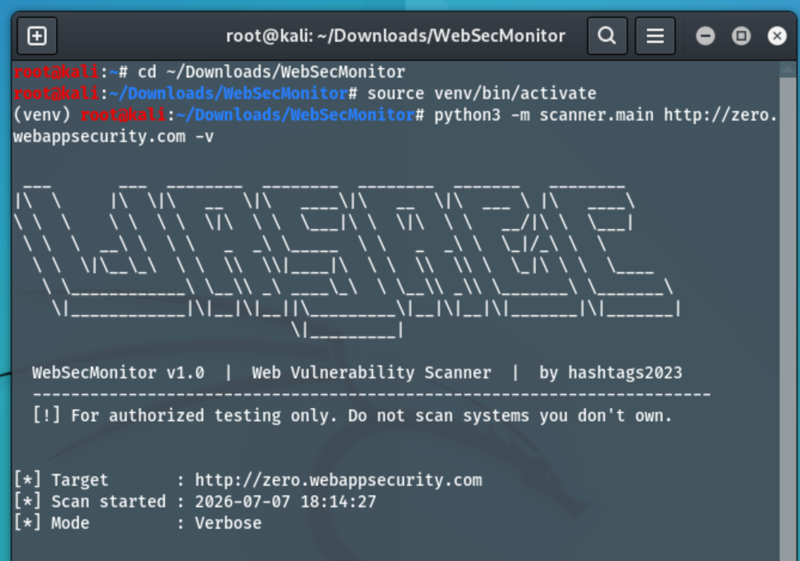
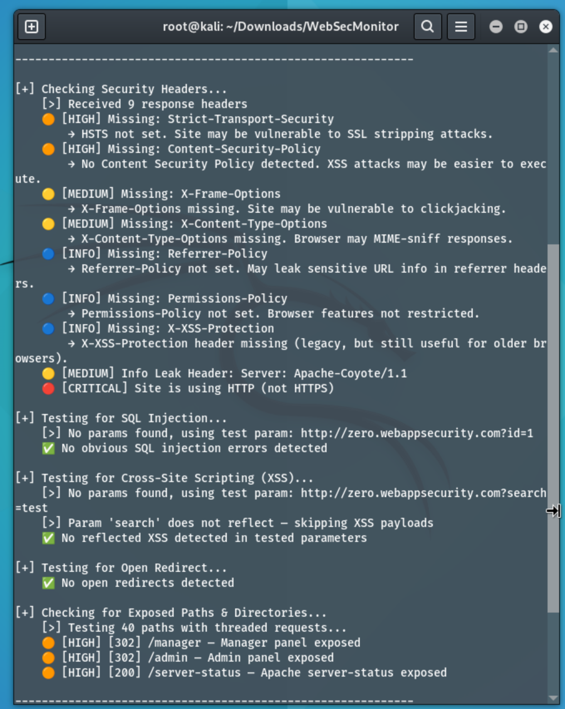
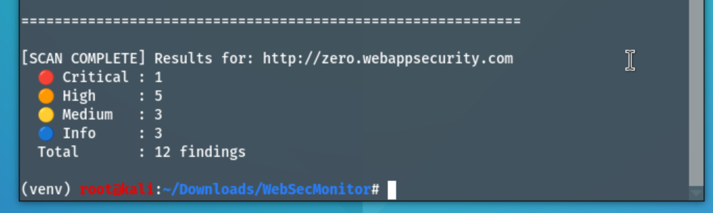
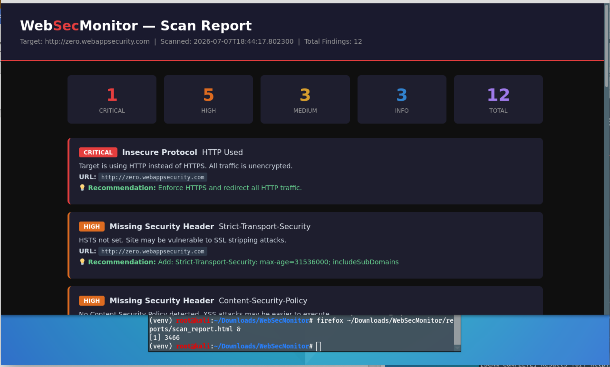
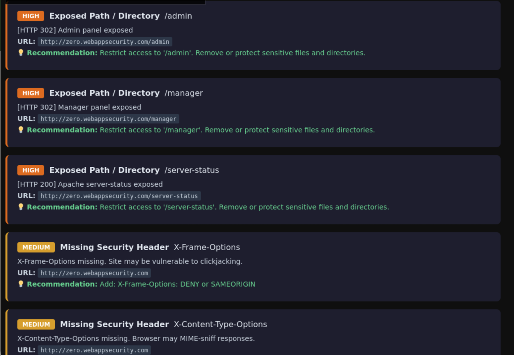
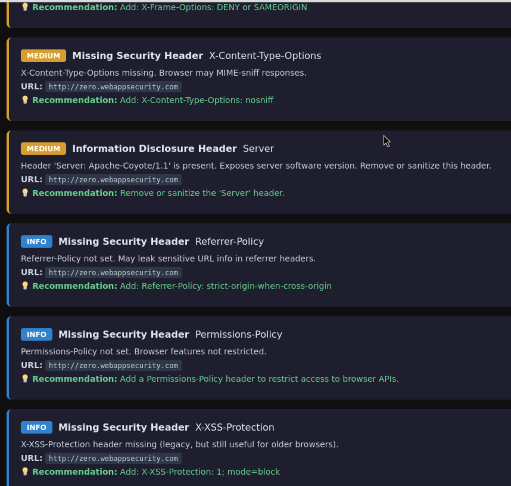

# 🔍 WebSecMonitor

> A Python-based web vulnerability scanner that identifies common security misconfigurations and attack vectors in web applications.


---

## 📸 Demo













```
 ___       ___  ________  ________  ________  _______   ________
|\  \     |\  \|\   __  \|\   ____\|\   __  \|\  ___ \ |\   ____\
\ \  \    \ \  \ \  \|\  \ \  \___|\ \  \|\  \ \   __/|\ \  \___|
 \ \  \  __\ \  \ \   _  _\ \_____  \ \   _  _\ \  \_|/_\ \  \
  \ \  \|\__\_\  \ \  \\  \\|____|\  \ \  \\  \\ \  \_|\ \ \  \____
   \ \____________\ \__\\ _\ ____\_\  \ \__\\ _\\ \_______\ \_______\
    \|____________|\|__|\|__||\_________\|__|\|__|\|_______|\|_______|

  WebSecMonitor v1.0  |  Web Vulnerability Scanner  |  by hashtags2023

[*] Target       : http://testphp.vulnweb.com
[*] Scan started : 2025-01-15 14:32:08
[*] Mode         : Standard

[+] Checking Security Headers...
    🟠 [HIGH] Missing: Strict-Transport-Security
    🟠 [HIGH] Missing: Content-Security-Policy
    🔴 [CRITICAL] Site is using HTTP (not HTTPS)

[+] Testing for SQL Injection...
    🔴 [CRITICAL] Possible SQLi in param 'id' | Payload: ' OR 1=1 --

[+] Testing for Cross-Site Scripting (XSS)...
    🟠 [HIGH] Reflected XSS in param 'search' | Payload: <script>alert('XSS')</script>

[SCAN COMPLETE]
  🔴 Critical : 3  🟠 High : 5  🟡 Medium : 4  🔵 Info : 6
```

---

## 🛡️ What It Scans For

| Module | Vulnerabilities Detected |
|--------|--------------------------|
| **Header Checker** | Missing HSTS, CSP, X-Frame-Options, X-Content-Type-Options, Referrer-Policy; Info-leaking headers |
| **SQL Injection** | Error-based SQLi via common payloads in URL parameters |
| **XSS Scanner** | Reflected XSS via unescaped parameter reflection |
| **Open Redirect** | Unvalidated redirects via common redirect parameters |
| **Directory Enum** | Exposed admin panels, `.env` files, `.git` repos, backups, config files, logs |

---

## 🚀 Getting Started

### Prerequisites
- Python 3.8+
- pip

### Installation

```bash
# Clone the repository
git clone https://github.com/hashtags2023/WebSecMonitor.git
cd WebSecMonitor

# Install dependencies
pip install -r requirements.txt
```

### Usage

```bash
# Basic scan
python -m scanner.main http://target.com

# Verbose mode
python -m scanner.main http://target.com -v

# Save HTML report
python -m scanner.main http://target.com -o report.html

# Save JSON report
python -m scanner.main http://target.com -o report.json
```

---

## 📊 Report Output

WebSecMonitor generates both **HTML** and **JSON** reports.

**HTML Report** — Dark-themed, color-coded by severity with remediation guidance:
- 🔴 Critical
- 🟠 High  
- 🟡 Medium
- 🔵 Info

**JSON Report** — Machine-readable output for integration into CI/CD pipelines or SIEMs.

---

## 🗂️ Project Structure

```
WebSecMonitor/
├── scanner/
│   ├── main.py            # Entry point & scan orchestrator
│   ├── header_checker.py  # Security header analysis
│   ├── sqli_scanner.py    # SQL injection testing
│   ├── xss_scanner.py     # Cross-site scripting detection
│   ├── open_redirect.py   # Open redirect testing
│   └── dir_enum.py        # Directory & path enumeration
├── utils/
│   ├── banner.py          # ASCII art banner
│   └── report.py          # HTML & JSON report generator
├── reports/               # Scan output directory
├── requirements.txt
└── README.md
```

---

## 🧠 Security Concepts Demonstrated

- **OWASP Top 10** — Covers injection, XSS, security misconfiguration, and sensitive data exposure
- **HTTP Security Headers** — Understanding of browser security mechanisms (CSP, HSTS, CORS)
- **Reconnaissance** — Automated path discovery and info gathering
- **Threat Modeling** — Severity classification (Critical/High/Medium/Info)
- **Reporting** — Structured output with actionable remediation advice

---

## ⚠️ Legal Disclaimer

> **This tool is intended for authorized security testing only.**  
> Only scan systems you own or have explicit written permission to test.  
> Unauthorized scanning is illegal and unethical.

For safe practice, test against intentionally vulnerable systems:
- [http://testphp.vulnweb.com](http://testphp.vulnweb.com) (Acunetix test site)
- [DVWA](https://github.com/digininja/DVWA)
- [OWASP WebGoat](https://github.com/WebGoat/WebGoat)

---

## 🗺️ Roadmap

- [ ] Form-based POST parameter injection testing
- [ ] Subdomain enumeration
- [ ] CORS misconfiguration detection
- [ ] SSL/TLS certificate analysis
- [ ] Rate limiting & brute-force detection
- [ ] CVE lookup integration
- [ ] Slack/email alerting for CI/CD pipelines

---

## 👩‍💻 Author

**Lori (hashtags2023)**  
B.S. Computer Science — CSU Sacramento  
Cybersecurity & AI Enthusiast  

[](https://linkedin.com/in/yourlinkedin)
[](https://github.com/hashtags2023)

---

## 📄 License

MIT License — see [LICENSE](LICENSE) for details.
